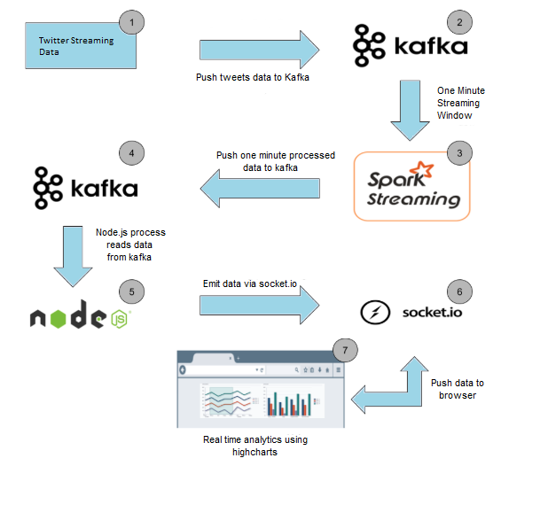

# Tweet Analysis using Kafka and Spark Streaming

Built a real-time analytics dashboard to visualize the trending hashtags and @mentions at a given location by using real time streaming twitter API to get data.

 

## Technology stack

  

<table>
<thead>
<tr>
<th>Area</th>
<th>Technology</th>
</tr>
</thead>
<tbody>
	<tr>
		<td>Front-End</td>
		<td> HTML5, Bootstrap, CSS3, Socket.IO, highcharts.js </td>
	</tr>
	<tr>
		<td>Back-End</td>
		<td>Express, Node.js</td>
	</tr>
  <tr>
		<td>Cluster Computing Framework</td>
		<td>Apache Spark (python)</td>
	</tr>
	<tr>
		<td>Message Broker</td>
		<td>Apache kafka</td>
	</tr>
</tbody>
</table>

 

## Architecture

 

 

## How it works
<ol>
    <li>Extract data from Twitter's streaming API and put it into Kakfa topic.</li>
    <li>Spark is listening to this topic, it will read the data from topic, analyze it is using spark streaming and put top 10 trending hashtags and @mentions into another kafka topic.</li>
    <li>Spark Streaming creates DStream whenever it read the data from kafka and analyze it by performing operation like map, filter, updateStateByKey, countByValues and forEachRDD on the RDD and top 10 hashtags and mentions are obtained from RDD using SparkSQL.</li>
    <li>Node.js will pick up the this data from kafka topic on server side and emit it to the socket.</li>
    <li>Socket will push data to user's dashboard which is rendered using highcharts.js in realtime.</li>
    <li>The dashboard is refreshed every 60 secs.</li>
</ol>

 

 

